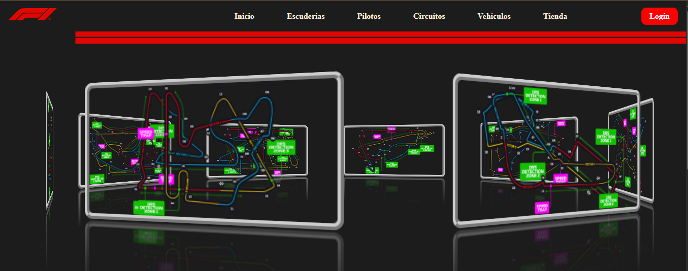
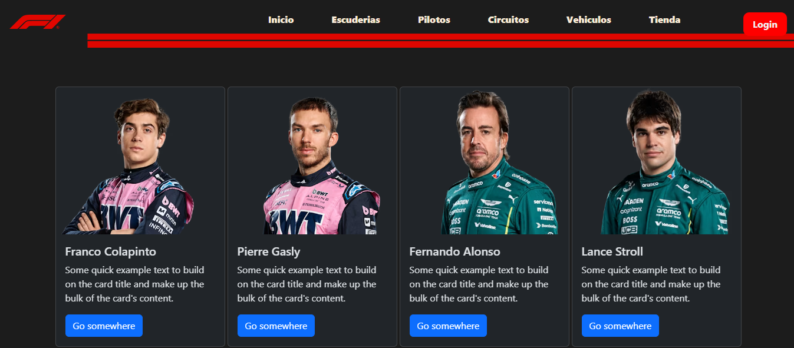
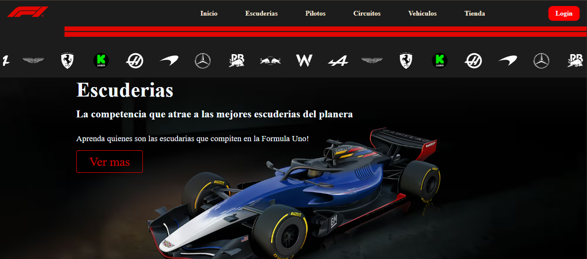

<div> <p style="text-align:center">  </p> </div> <h2 align="center" style="color:#CD5C5C">JLG'777' </h2> <p align="center"> <a href="https://git.io/typing-svg"></a> </p> <hr>


## 📧 Conéctate conmigo:

[](proyectojlg777@gmail.com)
[](https://linkedin.com/in/)
[](jorgeg777#9720)

<div align="center">
  
  <h1>F1 🏁 - The Unofficial Home of Formula 1 Racing</h1>
  <p>Proyecto web informativo sobre escuderías, pilotos, circuitos y vehículos de Fórmula 1.</p>
</div>


## 👔 Conéctate conmigo

[](mailto:proyectojlg777@gmail.com)
[](https://linkedin.com/in/TU-USUARIO)
[](https://discord.com/users/TU-ID)

## ℹ️ Descripción

Bienvenido al sitio web no oficial de la Fórmula 1.  
Este proyecto fue creado para presentar información de escuderías, pilotos, circuitos y más, utilizando HTML, CSS y Bootstrap.

## 🖼️ Funcionalidades

- Menú de navegación funcional
- Página de inicio con slider de logos de escuderías
- Página de pilotos (2025) con tarjetas informativas
- Diseño responsive con Bootstrap
- Footer con enlaces y redes sociales
- Separadores visuales entre secciones
- Adaptación para dispositivos móviles

## 🥇 Tecnologías usadas

- HTML5
- CSS3
- Bootstrap 5.x
- Font Awesome

## 📂 Estructura de carpetas

```text
public/
├── assets/
│   ├── icons/
│   ├── img/
│   └── drivers/
├── css/
│   └── style.css
├── pages/
│   ├── escuderias.html
│   ├── pilotos.html
│   ├── circuitos.html
│   ├── vehiculos.html
│   ├── tienda.html
│   └── login.html
└── index.html
```
## 🎞️ Capturas
## 🎞️ Capturas






## ✍️  Cómo ejecutar el proyecto
Clona el repositorio.
Abre la carpeta del proyecto.
Ejecuta index.html en tu navegador
(opcional: usar Live Server en VS Code para mejor experiencia).
Licencia
Este proyecto está bajo la Licencia MIT. Ver LICENSE para más información.


---

## ✒️ Autores

**Jorge Grandía** - _Trabajo Inicial_ - [JLG777](https://github.com/jlg777)

**Jorge Grandía** - _Documentación_ - [JLG777](#jlg777)

## 📄 Licencia

Este proyecto está bajo la Licencia MIT. Ver [LICENSE](./LICENSE) para más información.

## 🎁 Expresiones de Gratitud

- Comenta a otros sobre este proyecto 📢
- Invita una cerveza 🍺 o un café ☕ a alguien del equipo.
- Da las gracias públicamente 🤓.
- Dona con cripto a esta dirección:
  - (btc) 16ApGFxMXfF8ktysSkmLBzLEJPHubtwKjp
  - (btc-SegWit) bc1q0v8fvv3gvga02h9xspcg7npghjfyny20lavc37
  - (Ethereum) 0x1ee2842c194c95bc54473c6b27d602fc0bfc81a9

---

⌨️ con ❤️ por JLG777 😊

_Copyright (c) [2025] [jlg777]_
